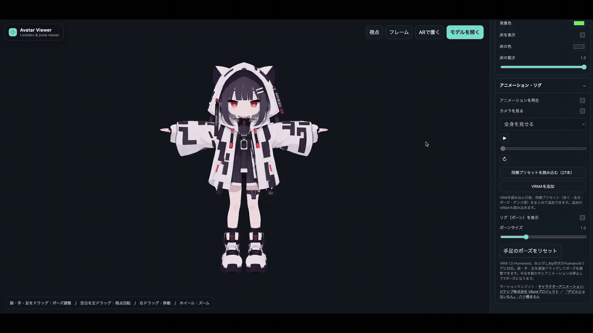

# Avatar Viewer



ブラウザで動く VRM / GLB / GLTF アバタービューワーです。

[ライブデモを開く](https://gltf-studio.lab.monoradio.jp)

## 主な機能

- VRM 1.0、GLB、GLTF の読み込み
- VRMA アニメーションの追加・再生
- トゥーン、マット、ピクセル風などの表示調整
- リグ表示、頭・手・足のドラッグ操作
- 正面・側面・背面・上面ビュー
- Android Chrome の WebAR（読み込んだ VRM を床に配置）
- 表示設定のローカル保存

## 使い方

静的ファイルとして配信して開いてください。

```bash
python3 -m http.server 8080
```

次に `http://localhost:8080` を開き、**VRM / GLB / GLTFを読み込む** からモデルを選択します。VRMA は **VRMAを追加** から読み込めます。

> `file://` 直開きでは ES Modules の読み込みが失敗する場合があります。

## Tripo からの利用

Tripo でモデル作成時に **VRM 1.0 Humanoid** を指定してリグ付けし、VRMとしてエクスポートしたモデルをそのまま読み込めます。VRMAは別途用意したものを **VRMAを追加** から読み込んでください。

## 対応モデル

Tripo で **VRM 1.0 Humanoid** を指定してリグ付けした VRM で、読み込み・VRMA 再生・ポーズ操作を確認しています。

## アセットについて

この公開リポジトリには、3Dモデルおよびモーション素材は含めていません。利用するモデル・VRMA のライセンスを各自で確認してください。

## Author

[monoradio](https://x.com/monoradio102)

## License

[MIT](LICENSE)

